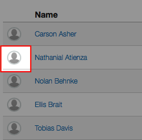
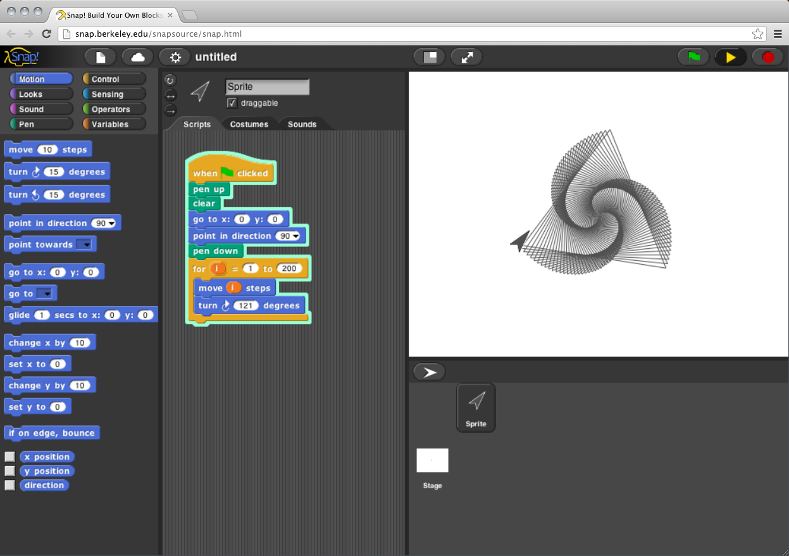
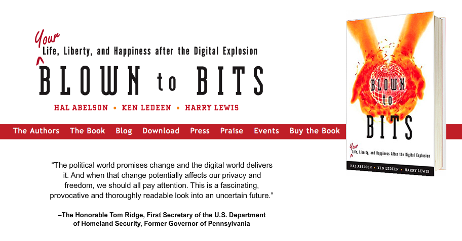

---

title:        COSC 1101 The Beauty & Joy of Computing
subtitle:     Course Introduction
author:       Ruben Gamboa
date:         September 31, 2015
#logo:         uw-logo-large.png
#biglogo:      uw-logo-large.png
job:          Professor
highlighter:  highlight.js
hitheme:      tomorrow
mode:         selfcontained
framework:    io2012
widgets:      [mathjax, bootstrap]

---

# Welcome

 

    

---

## First-Year Seminars (FYS)

> * Transition from high school to college life

> * Improve retention

> * Practice practicing a *life of the mind*

---

## Freshman Interest Groups (FIG)

> * Meet new friends

> * Support each other through the first semester

> * Study together

> * Build community

---

## Who We Are

> * Ruben Gamboa

> * Christopher Nickell

---&twocol

## Who You Are

Please, please upload a photo to WyoCourses!

*** =left

    

*** =right

    

---&twocol

## Who You Are

Please, please upload a photo to WyoCourses!

And upload a useful photo, not one of these:

*** =left

    

*** =right

    

---

# Course Overview

We will learn how to program

    

 

More important, we will learn how programming affects our lives

---

## Textbook

**Blown to Bits: Your Life, Liberty, and Happiness after the Digital Explosion**, by Hal Abelson, Ken Ledeen, and Harry Lewis. Addison-Wesley. 1st Edition. 2008.

http://www.bitsbook.com

    

---

## Grades

Component                | %Weight   | Min%
-------------------------|-----------|---------------
Class Participation      | 20%       |            50%
Programming Assignments  | 15%       |            50%
School Activities        | 10%       |           100%
TIP WyoCourses Module    | 10%       |            80%
Project                  | 15%       |            50%
Exams (3)                | 10% each  |   50% combined

---

## Participation

* Very, very important that you read ahead of class

* May involve both Piazza and in-class discussions

* Reading schedule in syllabus

* Rubric for grading participation also in syllabus

---

## Programming Assignments

* Fridays, we will meet in EN 4059

* That's the day we will work on programming during class

* You may complete your assignments then or outside of class

* You may also visit me during my office hours for help

---

## School Activities

* Sporting event (*)
* Musical event
* Performing arts event
* Professional society meeting (*)
* Technical presentation

Items marked with (*) are taken care of by your FIG RA's planned activities

---

## TIP WyoCourses Module

* You can do this on your own time

* This will familiarize you with the resources available at the library

* This is essential for any research papers you will write while at UW (starting with this course)

---

## Project

* Topic is of your choosing (with my approval)

* It involves both writing and programming

* You can choose how much writing vs. programming

* You must follow the *writing process* (because this is a FYS)

* Rubric for grading project in syllabus

---

# Basic Policies

* Come to class

* Do not use cellphones, tablets, computers, etc. during class

* Participate in class

* Turn assignments in on time

* Follow the honor code:

  > Do not lie, cheat or steal or tolerate those who do.

