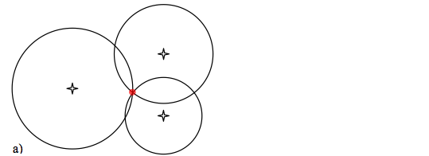

---

title:        COSC 1101 The Beauty & Joy of Computing
subtitle:     Blown to Bits. Digital Explosion
author:       Ruben Gamboa
date:         October 2, 2015
#logo:         uw-logo-large.png
#biglogo:      uw-logo-large.png
job:          Professor
highlighter:  highlight.js
hitheme:      tomorrow             # default
mode:         selfcontained        # {standalone, draft}
framework:    io2012               # {io2012, html5slides, shower, dzslides, revealjs, ...}
widgets:      [mathjax, bootstrap] # {mathjax, quiz, bootstrap}

---

<style>
slide.title-slide {
     background-color: #EDE0CF; /* CBE7A5; #EDE0CF; ; #CA9F9D*/
     background-image: url(assets/img/uw-logo-large.png);
     background-repeat: no-repeat;
     background-position: center top;
   }
slide:not(.title-slide) {
    background-image: url(assets/img/uw-logo-small.png);
    background-repeat: no-repeat;
    background-position: right bottom;
    background-size: 24px;
}
</style>

# Staying on Course


---

## The Trapdoor

<br>

<div class="centered">
    
</div>

<br>

https://euonymous.wordpress.com/tag/ideo/

---

## Project Motivation

<br>

<div class="centered">
    
</div>

<br>

http://massivevoodoo.blogspot.com/2014/07/inspiration-paintingproject-motivation.html

---

# Technical Summary

---

## On Bits

> * What is a bit?

> * How does it quantify information?

> * Are *information* and *data* different or the same?

---

## On Triangulation

<br>

<div class="centered">
    
</div>

---

## On Triangulation

<br>

<div class="centered">
    
</div>


---

## On Moore's Law

> * What is *Moore's Law*?

> * Who is this *Moore* fellow, anyway?

> * Has *Moore's Law* really stopped?

> * What about the *Singularity*?

---&twocol

## On Exponential Growth

*** =left

```{r exponential-growth-1,echo=FALSE}
xs <- 1:100
ys <- 2^xs
plot(xs, ys, , type="n", , xlab="", ylab="")
lines(xs, ys)
```

---&twocol

## On Exponential Growth

*** =left


*** =right

```{r exponential-growth-2,echo=FALSE}
xs <- 1:1000
ys <- 2^xs
plot(xs, ys, , type="n", , xlab="", ylab="")
lines(xs, ys)
```

---

## Linear Growth

```{r exponential-growth-3,echo=FALSE}
xs <- 1:100
ys1 <- xs
colors <- rainbow(3)
plot(xs, ys1, , type="n", xlab="", ylab="")
lines(xs, ys1, col=colors[1], lty=1, pch=18)
legend(xs[1], ys1[length(ys1)], c("Linear"), lty=c(1), pch=c(18), col=colors)

```

---

## Linear and Quadratic Growth

```{r exponential-growth-4,echo=FALSE}
xs <- 1:100
ys1 <- xs
ys2 <- xs^2
colors <- rainbow(3)
plot(xs, ys2, type="n", xlab="", ylab="")
lines(xs, ys1, col=colors[1], lty=1, pch=18)
lines(xs, ys2, col=colors[2], lty=1, pch=19)
legend(xs[1], ys2[length(ys2)], c("Linear", "Quadratic"), lty=c(1,1), pch=c(18, 19), col=colors)

```

---

## Linear, Quadratic, and Exponential Growth

```{r exponential-growth-5,echo=FALSE}
xs <- 1:100
ys1 <- xs
ys2 <- xs^2
ys3 <- 2^xs
colors <- rainbow(3)
plot(xs, ys3, , type="n", xlab="", ylab="")
lines(xs, ys1, col=colors[1], lty=1, pch=18)
lines(xs, ys2, col=colors[2], lty=1, pch=19)
lines(xs, ys3, col=colors[3], lty=1, pch=20)
legend(xs[1], ys3[length(ys3)], c("Linear", "Quadratic", "Exponential"), lty=c(1,1,1), pch=c(18, 19, 20), col=colors)

```

---

## Exponential Early Warning

```{r exponential-growth-6,echo=FALSE}
M <- 1000000
ys <- 1:M
xs3 <- log2(ys)
colors <- rainbow(3)
plot(xs3, ys, , type="n", xlab="", ylab="")
lines(xs3, ys, col=colors[3], lty=1, pch=20)
abline(h=M/2)
abline(v=log2(M/2))
legend(xs3[1], M, c("Exponential"), lty=c(1), pch=c(20), col=colors[3])

```

---

## Quadratic and Exponential Early Warning

```{r exponential-growth-7,echo=FALSE}
M <- 1000000
ys <- 1:M
xs2 <- sqrt(ys)
xs3 <- log2(ys)
colors <- rainbow(3)
plot(xs2, ys, , type="n", xlab="", ylab="")
lines(xs2, ys, col=colors[2], lty=1, pch=19)
lines(xs3, ys, col=colors[3], lty=1, pch=20)
abline(h=M/2)
abline(v=sqrt(M/2))
legend(xs2[1], M, c("Quadratic", "Exponential"), lty=c(1, 1), pch=c(19, 20), col=colors[2:3])

```

---

## Linear, Quadratic, and Exponential Early Warning

```{r exponential-growth-8,echo=FALSE}
M <- 1000000
ys <- 1:M
xs1 <- ys
xs2 <- sqrt(ys)
xs3 <- log2(ys)
colors <- rainbow(3)
plot(xs1, ys, , type="n", xlab="", ylab="")
lines(xs1, ys, col=colors[1], lty=1, pch=18)
lines(xs2, ys, col=colors[2], lty=1, pch=19)
lines(xs3, ys, col=colors[3], lty=1, pch=20)
abline(h=M/2)
abline(v=M/2)
legend(xs1[1], M, c("Linear", "Quadratic", "Exponential"), lty=c(1, 1, 1), pch=c(18, 19, 20), col=colors)

```

--- 

# Discussion Questions

---

## Questions

> * Are bits always harmless?

> * What if I gave you the homework in PostScript instead of PDF or HTML?

> * What if I gave you the homework in 8" floppy disks?  Do you even know what a "floppy disk" is???

> * What privacy can you expect?

> * When do you sell privacy?

> * Are technologies good or bad?
    * Tor
    * BitCoin
    * Encryption
    * Trusted Computing

---

## Koans of Bits

> * It's All Just Bits

> * Perfection is Normal

> * There Is Want in the Midst of Plenty

> * Processing is Power

> * More of the Same Can Be a Whole New Thing

> * Nothing Goes Away

> * Bits Move Faster Than Thought

