---

title:        COSC 1101 The Beauty & Joy of Computing
subtitle:     Blown to Bits. Digital Explosion
author:       Ruben Gamboa
date:         October 2, 2015
#logo:         uw-logo-large.png
#biglogo:      uw-logo-large.png
job:          Professor
highlighter:  highlight.js
hitheme:      tomorrow             # default
mode:         selfcontained        # {standalone, draft}
framework:    io2012               # {io2012, html5slides, shower, dzslides, revealjs, ...}
widgets:      [mathjax, bootstrap] # {mathjax, quiz, bootstrap}

---

# Staying on Course

---

## The Trapdoor

 

    

 

https://euonymous.wordpress.com/tag/ideo/

---

## Project Motivation

 

    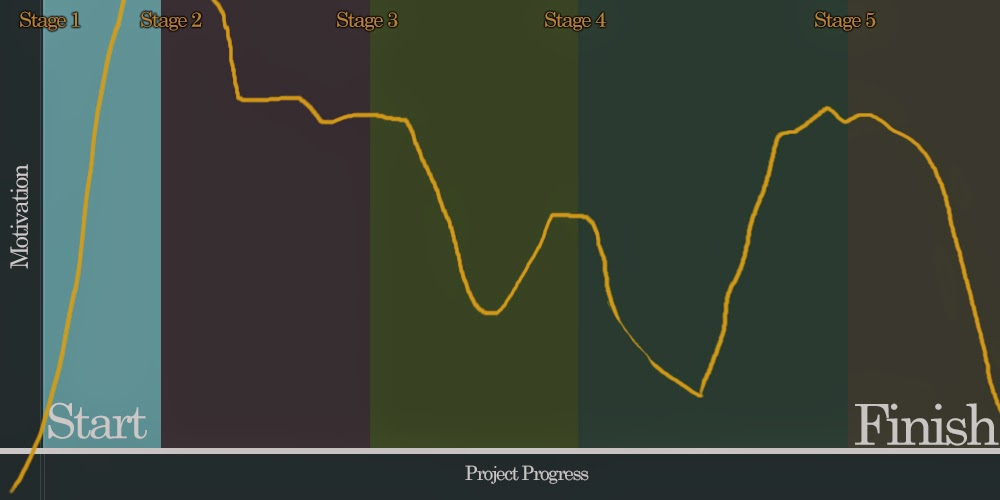

 

http://massivevoodoo.blogspot.com/2014/07/inspiration-paintingproject-motivation.html

---

# Technical Summary

---

## On Bits

> * What is a bit?

> * How does it quantify information?

> * Are *information* and *data* different or the same?

---

## On Triangulation

 

    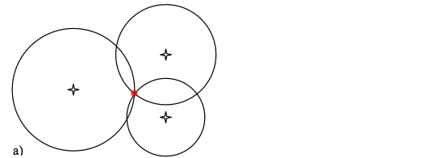

---

## On Triangulation

 

    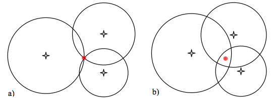

---

## On Moore's Law

> * What is *Moore's Law*?

> * Who is this *Moore* fellow, anyway?

> * Has *Moore's Law* really stopped?

> * What about the *Singularity*?

---&twocol

## On Exponential Growth

*** =left

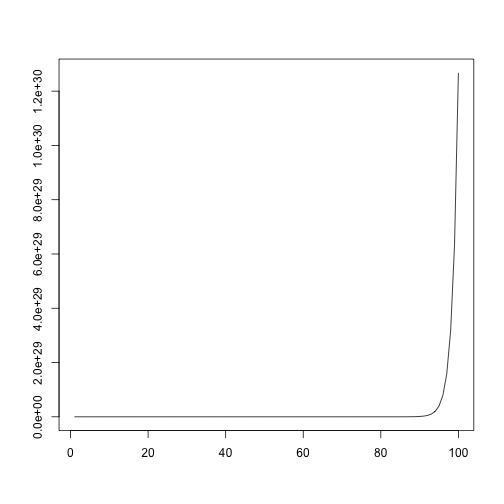 

---&twocol

## On Exponential Growth

*** =left

*** =right

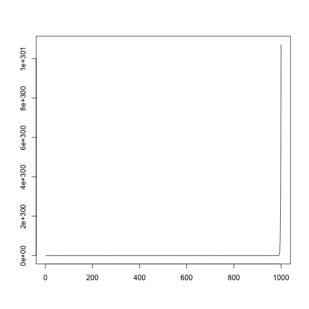 

---

## Linear Growth

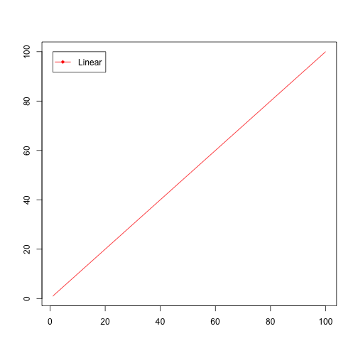 

---

## Linear and Quadratic Growth

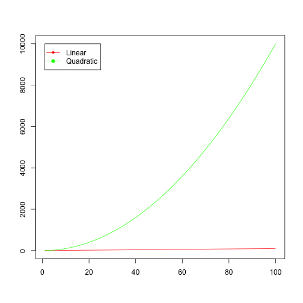 

---

## Linear, Quadratic, and Exponential Growth

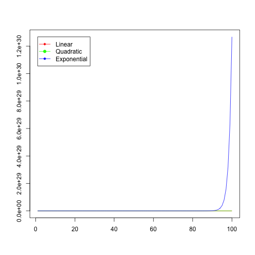 

---

## Exponential Early Warning

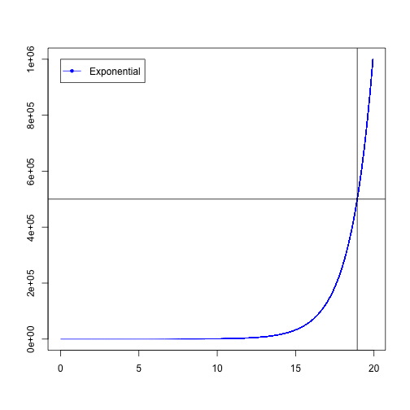 

---

## Quadratic and Exponential Early Warning

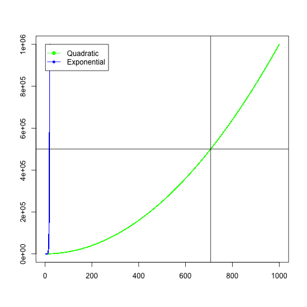 

---

## Linear, Quadratic, and Exponential Early Warning

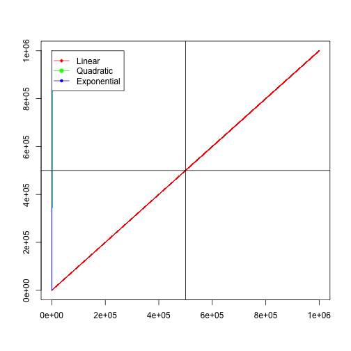 

--- 

# Discussion Questions

---

## Questions

> * Are bits always harmless?

> * What if I gave you the homework in PostScript instead of PDF or HTML?

> * What if I gave you the homework in 8" floppy disks?  Do you even know what a "floppy disk" is???

> * What privacy can you expect?

> * When do you sell privacy?

> * Are technologies good or bad?
    * Tor
    * BitCoin
    * Encryption
    * Trusted Computing

---

## Koans of Bits

> * It's All Just Bits

> * Perfection is Normal

> * There Is Want in the Midst of Plenty

> * Processing is Power

> * More of the Same Can Be a Whole New Thing

> * Nothing Goes Away

> * Bits Move Faster Than Thought

