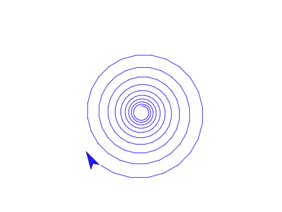

---

title:        COSC 1101 The Beauty & Joy of Computing
subtitle:     Lab 2
author:       Ruben Gamboa
date:         September 11, 2015
#logo:         uw-logo-large.png
#biglogo:      uw-logo-large.png
job:          Professor
highlighter:  highlight.js
hitheme:      tomorrow             # default
mode:         selfcontained        # {standalone, draft}
framework:    io2012               # {io2012, html5slides, shower, dzslides, revealjs, ...}
revealjs:     
    theme: blood
    transition: rotate
    center: "false"
widgets:      [mathjax, bootstrap] # {mathjax, quiz, bootstrap}

---

## Quick Announcements

* Check out the Piazza forums for this class

* Links to next week's reading are in Piazza
  * Also on syllabus, but one of the links is behind a paywall

---

## Playing with Turtle Graphics

* Explore the following blocks
  * Motion > move
  * Motion > turn
  * Motion > point
  * Motion > go to x y
  * Pen > clear
  * Pen > pen down
  * Pen > pen up
  * Control > repeat

---

## Build the Following (or Even Better) Shapes

---

## Finish Early?

* Awesome! Try out these challenges:

* You do not have to complete (or even start) these challenges, 
  but you may not leave early unless you do

* And before you leave, check with me so that I know the projects are shared correctly

