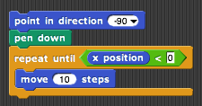

---

title:        COSC 1101 The Beauty & Joy of Computing
subtitle:     Lab 3. Random Walks
author:       Ruben Gamboa
date:         September 11, 2015
#logo:         uw-logo-large.png
#biglogo:      uw-logo-large.png
job:          Professor
highlighter:  highlight.js
hitheme:      tomorrow             # default
mode:         selfcontained        # {standalone, draft}
framework:    io2012               # {io2012, html5slides, shower, dzslides, revealjs, ...}
revealjs:     
    theme: blood
    transition: rotate
    center: "false"
widgets:      [mathjax, bootstrap] # {mathjax, quiz, bootstrap}

---

## Random Walks

* A **random walk** happens when the turtle moves
  * a fixed (or random) amount
  * in a random direction

* You can perform a random walk in *Snap!* with these blocks
  * Motion > move X steps
  * Motion > point in direction X
  * Operators > pick random X to Y

---

## If Blocks & Conditions

* An **IF** block allows you to execute different blocks, depending on a condition
* The condition can be as simple as comparing two numbers

 

    

---

## Repeat Until Block

* A **REPEAT UNTIL** block executes some blocks repeatedly, until some condition is true
* E.g., keep checking the Broncos score until victory is secured

 

    

---

## Variables

* Blocks like **x position** are called **variables**
* They are used to store a number, text, whatever
* What they store can change over time

* You can create your own variables to keep track of something of interest, e.g., the score in a game
  * Variables > make a variable
  * Variables > set X to V
  * Variables > change X by DX
* TIP: Use the checkbox next to the variable to have its value show up on the run area

---

## Variables: What Am I?

* Most **errors** when using variables happen because you forget what the variable is supposed to have in it

* Don't do that!

* Always **write down** a statement that describes what the variable stores:
  * **number of steps** keeps track of the number of steps the turtle has taken in this simulation run
  * **cumulative number of steps** keeps track of the number of steps the turtle has taken in all simulation runs up to the current one
  * **number of simulations** keeps track of how many simulation runs we have performed so far

* When you submit your solution, be sure to give me one explanatory sentence per variable!!!

---

## Part 1: Solar Photons

* Background (Source: http://ds9.ssl.berkeley.edu/LWS_GEMS/2/random.htm)
  * Photons are created at (OK, near) the center of the Sun
  * On their journey to the surface of the Sun, they keep running into particles (mostly electrons)
  * As they bounce from the particles, they head off in a random direction

* Simulate this by
  1. Drawing a circle of radius X (maybe use a "variable" for the radius, and use 100 to start)
  2. Placing the turtle at the center
  3. Repeatedly pick a random direction and move by 1 step in that direction
  4. Stop when the photon is a distance greater than X from the center
  5. Of course, keep track of the number of steps it took the photon to get to the surface
  6. Repeat this simulation a number of times (say 10), so you can find the average of the number of steps it takes
     a photon to get to the surface

---

## Part 1: Solar Photons Hints

* You can draw a circle of radius $R$ by using your POLYGON block
  * The turtle needs to turn by 360 degrees, so let's use a POLYGON with 360 sides
  * The total circumference (\*cough, cough\* perimeter) of the circle is $2\pi R$
  * So each "side" of the polygon should be around $2\pi R/360$ steps

* Approach the problem in steps
  1. First, get the circle working
  2. Then, get one random walk working
  3. Finally, worry about doing this repeatedly to find the average

---

## Part 2: Stock Option Pricing

* Background (Source: https://en.wikipedia.org/wiki/Call_option)
  * An **European call** option gives you the right (but not the obligation) to purchase a stock at a given price 
    at some point in the future
  * The stock is the **underlying asset**
  * The given price is called the **strike price**
  * The future date is called the **expiry date**

* So what is it worth to buy XYZ at \$102 in 30 days?
* This is called **the premium**, and we assume it's the **fair value** of the option
* We can assume that it is equal to the **expected profit** of holding the option

---

## Part 2: Stock Option Pricing

* We'll calculate the fair option of a stock option by using a random walk

* **Key assumption:** The value of the underlying asset is a **random walk**
  * On any given day, it either goes up by 1 or down by 1 -- totally at random
  * NB: [A Random Walk Down Wall Street](http://www.amazon.com/Random-Walk-Down-Wall-Street/dp/0393340740/)

* At the expiry date, the value of the option is easy to calculate
  * The price of the underlying asset is $P$
  * The strike price is $S$
  * If $P>S$ (the option is **in the money**), then the value is $S-P$
  * If $P\le S$ (the option is **out of the money**), then it's worthless, so the value is $0$

---

## Part 2: Stock Option Pricing

* Now, run many simulations
  * Assume the option's expiry date is 30 days in the future
  * On each day, the price goes up by 1 or down by 1 at random
  * After 30 days, figure out what the price is and compute the **profit** on that simulation
  * Average the profit over many simulations to find the fair value of the option
  * That fair value should be the price (aka premium) of the option

* Bells and whistles:
  * Draw a chart that shows the value of the underlying asset over the 30 days
  * I.e., your program should draw the random walk
  * On each day, color the line from day N to day N+1 green if the option is profitable on day N+1
    and red otherwise

---

## Extras

* Solar Photons
  * Change the radius to various different values
  * Plot the results in a graph (x-axis is radius, y-axis is number of steps)
  * Can you predict what the #steps is, as a function of radius?  I.e., for radius $R$, 
    the photons will take $f(R)$ steps
  * Try doing this for 3D -- the sun is a sphere, not a circle!
  * This is harder than it seems. Do you see why?

 

* Stock Option Pricing
  * Add a (horizontal) line that corresponds to the strike price
  * Change your code so that the random walk is green above this line and red below
  * I.e., it can change between days, not the same color for an entire day
