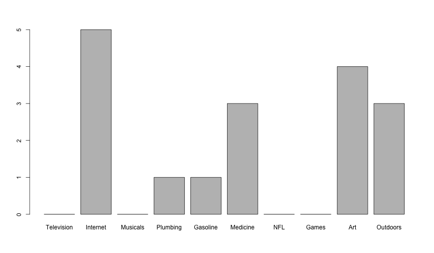

---

title:        COSC 1101 The Beauty & Joy of Computing
subtitle:     Blown to Bits. Naked in the Sunlight
author:       Ruben Gamboa
date:         September 21, 2015
#logo:         uw-logo-large.png
#biglogo:      uw-logo-large.png
job:          Professor
highlighter:  highlight.js
hitheme:      tomorrow             # default
mode:         selfcontained        # {standalone, draft}
framework:    io2012               # {io2012, html5slides, shower, dzslides, revealjs, ...}
widgets:      [mathjax, bootstrap] # {mathjax, quiz, bootstrap}

---

# Staying on Course

---

## Take Care of Yourself!

 

    

 

http://www.hercampus.com/school/u-mass-amherst/gif-story-10-reasons-being-sick-college-worst

---

# Side Issue: What Matters

 

---

# On Privacy

---

## Why Did We Lost It?

* Last week, we saw some technical developments that allowed our privacy to disappear

 

* This week's theme is **why** we lost our privacy
  * Saving time
  * Saving money
  * Convenience
  * Fun
  * Just had to

---

## Two Little Brothers

* Big Brother is watching us...can we use the same tools to watch back?

* Anyone can watch us, not just *the* Big Brother of Orwell

---

## Why Can Anyone Watch?

* Ease of access

* Extreme ease of access, open to amateur hour

---

## Other Big Brothers

* Other countries

* Things not covered by outdated laws

* Advances in technology repurposing old surveillance

* Mixing government and private industry

---

## A New Privacy

* Can we control what others know? (Warren-Brandeis Privacy)

* Can we control what they do with that knowledge? (Westin Privacy)

* Best practices?
  * Openness
  * Disclosure
  * Secondary use
  * Correction
  * Security

---

## Connecting Dots

* With all this data, why can't we predict crime?

* What if we give away our privacy to have more safety?

---

## A Simple Lesson in Statistics

* Suppose 1% of the population is a terrorist
  * It's actually a lot less than that, thankfully!
  * About 10,000-30,000 deaths due to terrorism worldwide
  * In the US, your chances of getting crushed by your own furniture are comparable

* Let's write a program that predicts whether person X is a terrorist
  * Easiest program to write: "No!" is accurate 99% of the time

---

## A Simple Lesson in Statistics (Part II)

* Conversely, let's say we have a program that works 99% of the time (with Yes and No)
  * Given 150,000,000 adults in the US, we have 1,500,000 terrorists and $148,500,000$ non-terrorists
  * So 99% accuracy means we get it wrong for 15,000 terrorists and 1,485,000
  * That's one and a half million people we claim are terrorists but are not
  * Big burden on law enforcement, and worse on the falsely accused
  * And we're still letting 15,000 through the cracks

* What if the percentage of terrorists is even smaller
* E.g., if 0.1% of adults are terrorists
  * 1,500 terrorists fall through the cracks
  * 1,498,500 falsely accused

