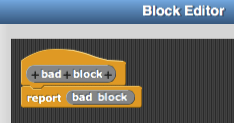
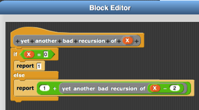

---

title:        COSC 1101 The Beauty & Joy of Computing
subtitle:     Lab 7. Recursion
author:       Ruben Gamboa
date:         October 30, 2015
#logo:         uw-logo-large.png
#biglogo:      uw-logo-large.png
job:          Professor
highlighter:  highlight.js
hitheme:      tomorrow             # default
mode:         selfcontained        # {standalone, draft}
framework:    io2012               # {io2012, html5slides, shower, dzslides, revealjs, ...}
revealjs:     
    theme: blood
    transition: rotate
    center: "false"
widgets:      [mathjax, bootstrap] # {mathjax, quiz, bootstrap}

---

## Idea of Recursion

* Recursion is almost heretical
* The idea is to define a block using that very same block
* This sounds like circular definitions!

---

## Why Recursion Is Not Circular

* Consider these block definitions

    
    

* And compare to this one

    

---

## What's the Difference?

    
    

* Good recursion defines a block of X, as supposed to just a block
* Block of X can use Block of Y
* Block of Y can use Block of Z
* And so on
* As long as Block of X doesn't use Block of X directly or indirectly, there are no circular definitions
* And we know this is OK because **X gets smaller every time**

---

## What's the Difference? (Advanced)

    
    

* The value of X is still getting smaller

* But it doesn't work
  * Hint: What happens when X is -1?
  * And what if X is 1?

---

## Recursion and Loops

* Recursion and loops can be used interchangeably 
  * Some people find loops easier to understand
  * Others find recursion easier

* In some situations, recursion can be significantly easier
  * We'll see the big example of that next week

* For now, we'll revisit the programs using loops to use recursion instead

---

## Example 1: Process all numbers from 1 to N

        sum up to N
            if N < 1
                report 0
            else
                report N + (sum up to N-1)

* Important: Do NOT try to figure `(sum up to N-1)` here!
* Instead, simply assume that this sum is computed correctly, and use it here in the right way
* One of my colleagues calls this **faith-based programming**

---

## Example 2: Summarizing a list

        sum elements of L
            if length of L = 0
                report 0
            else
                report (item 1 of L) + (sum elements of (all but first of L))

        minimum element of L
            if length of L = 1
                report item 1 of L
            else
                if (item 1 of L) < (minimum element of (all but first of L))
                    report (item 1 of L)
                else
                    report (minimum element of (all but first of L))

---

## Example 3: Finding an element in a list

        find first even element of L
            if length of L = 0
                report error
            else
                if (item 1 of L) is even
                    report item 1 of L
                else
                    report (find first even element of (all but first of L))

---

## Example 4: Transforming all elements of a list

        double L
            if length of L = 0
                report L
            else
                report (2 * (item 1 of L)) in front of (double (all but first of L))

---

## Using Lists: Filtering a list

        even elements of L
            if length of L = 0
                report L
            else
                if (item 1 of L) is even
                    report (item 1 of L) in front of (even elements of (all but first of L))
                else
                    report (even elements of (all but first of L))

---

## Part 1

* Build these blocks using recursion
  * **Product** of all elements in list L
  * **Smallest** element of list L
  * **Square** each element of list L
  * List of all elements of L that are **Prime**
    * Or at least, all elements that are **odd**

---

## Part 2

* Start with your solution to Lab 5, specifically Part 1 of that lab, which creates
  * Course *name* with *credits* credits and a grade of *grade*
  * Name of *course*
  * . . . .

* Using recursion, build a block called "GPA of *courses*" that will go through a list of courses and compute your GPA

        set Courses to list Course "Calculus I" with 4 credits and a grade of A,
                            Course "English Composition" with 3 credits and a grade of B,
                            Course "Physics I" with 4 credits and a grade of B
        say GPA of Courses for 2 secs

* This program should say 3.3636 (because $\frac{4\cdot4 + 3\cdot3 + 4\cdot3}{4+3+4} = 3.3636$)

