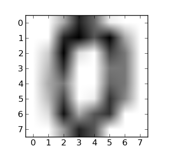

---

title:        COSC 1101 The Beauty & Joy of Computing
subtitle:     Lab 10. Machine Learning
author:       Ruben Gamboa
date:         December 4, 2015
#logo:         uw-logo-large.png
#biglogo:      uw-logo-large.png
job:          Professor
highlighter:  highlight.js
hitheme:      tomorrow             # default
mode:         selfcontained        # {standalone, draft}
framework:    io2012               # {io2012, html5slides, shower, dzslides, revealjs, ...}
revealjs:     
    theme: blood
    transition: rotate
    center: "false"
widgets:      [mathjax, bootstrap] # {mathjax, quiz, bootstrap}

---

## Machine Learning

* **Machine learning** sounds deeply mysterious
* Do you know how **you** learn?
* Do you know how **anybody** learns?

 
 

* How can we teach computers to learn????

---

## Machine Learning Demystified

* Let's define **machine learning** to mean **the machine gets better at something**
* So learning is about **improving performance** of some task

 
 

* Better yet, learning is about **optimizing performance**

---

## Sample Problem

* Suppose we have a bunch of data points, each with an **x** and a **y** coordinate
  * x = length of phone call, y = location of phone
  * x = size of lump, y = location of lump
  * x = high school GPA, y = ACT composite store
  * x = number of times 'easy' appears in message, y = number of times 'money' appears

* Each data point is also classified as either "green" or "red"
  * green = terrorist, red = just fine
  * green = cancer, red = not cancer
  * green = will graduate, red = will drop out
  * green = spam, red = ham

* The goal is to **automatically figure out** the classification from the values of **x** and **y**
* And we want the computer to get better and better at this

---

## Sample Problem

* Let's make some assumptions that make it easier to classify points based on **x** and **y** coordinates

1. Classes are **linearly separable**, i.e., the 1s are on the right side of some line, and the 2s are on the other
2. The line passes **through the origin**

* With these assumptions, all we have to do is find the right angle (or slope, if you prefer) for the line

---

## Sample Classification

    

---

## Finding the Optimal Line

* Let's use **brute force**!

* Start with angle 1&deg;, they try angle 2&deg;, ..., up to angle 360&deg;

* For each angle, figure out how many errors it makes
  * I.e., the line will classify a point as "green" or "red" depending on whether it's to the right or left of the line
  * We also know from the data points whether it **should be** "green" or "red"
  * So the number of errors is the number of points that are classified incorrectly

* The angle we pick is the angle that results in the smallest number of errors
* Ties are broken arbitrarily

---

## Nasty Detail

* How do you know if a point is to the right or the left of the line with angle $\theta$????

* This takes some work

* The equation of the line is $y = \tan(\theta)x$

* We can avoid the nasty case of $\theta = 90$ by breaking this up as $y = \frac{\sin(\theta)}{\cos(\theta)} x$

* That means that $\cos(\theta) y - \sin(\theta)x = 0$

* Now, if the point is to the **right** of the line, we have
  * $\cos(\theta) y - \sin(\theta)x < 0$

* Now, if the point is to the **left** of the line, we have
  * $\cos(\theta) y - \sin(\theta)x > 0$

---

## Machine Learning

* That's it!

* If you do "brute force" as described above your code will **learn** the best value of $\theta$

* I.e., it will find the line that best classifies the data points into green or red

---

## The Lab

* Demo time!

1. Import the blocks from [the starter code](./learning-blocks.xml "Learning Blocks")
2. Run the block called **Generate Sample Data** and store the results in a variable
3. Write a block called **Learn Boundary from _Data_** that will do the brute force approach mentioned above
4. Evaluate your answer using the block called **Draw _Data_ with Boundary at _Boundary_**

* Hints:
  * Edit the **Generate Sample Data** block
  * Change the number of data points to 10 (to speed up learning)
  * Disable the automated error generation, e.g., by checking for **=0** instead of **=1**

---

## Machine Learning in Real Life

* Instead of doing brute force, we guess the "next" value of $\theta$ using **magic** (actually, calculus)
  * This is **much faster**!!!
  * Basic math for machine learning: Linear Algebra and Calculus III

* Lines do not have to pass through the origin

* We can break ties in better ways (e.g., right down the middle of the different classes)

    
    &nbsp;
    &nbsp;
    &nbsp;
    &nbsp;
    &nbsp;
    

---

## Machine Learning in Real Life

* It doesn't have to be a straight line!

    

---

## Machine Learning in Real Life

* We can have more dimensions than just **x** and **y**

* E.g., we can classify images based on their pixel values

* So a 1000x1000 image would have 1,000,000 dimensions!

    
    &nbsp;
    &nbsp;
    &nbsp;
    &nbsp;
    &nbsp;
    

