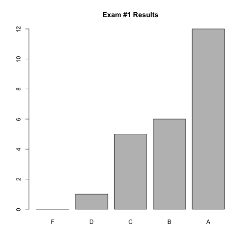
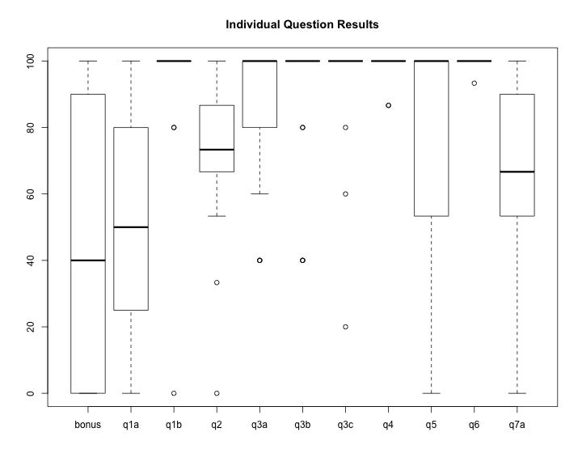

---

title:        COSC 1101 The Beauty & Joy of Computing
subtitle:     Exam #1 Results
author:       Ruben Gamboa
date:         October 7, 2015
#logo:         uw-logo-small.png
#biglogo:      uw-logo-large.png
job:          Professor
highlighter:  highlight.js
hitheme:      tomorrow             # default
mode:         selfcontained        # {standalone, draft}
framework:    io2012               # {io2012, html5slides, shower, dzslides, revealjs, ...}
widgets:      [mathjax, bootstrap] # {mathjax, quiz, bootstrap}

---

<style>
slide.title-slide {
     background-color: #EDE0CF; /* CBE7A5; #EDE0CF; ; #CA9F9D*/
     background-image: url(assets/img/uw-logo-large.png);
     background-repeat: no-repeat;
     background-position: center top;
   }
slide:not(.title-slide) {
    background-image: url(assets/img/uw-logo-small.png);
    background-repeat: no-repeat;
    background-position: right bottom;
    background-size: 24px;
}
</style>

## Exam Questions

Question   | Points | Topic
-----------|--------|-----------------------------------
q1a        |     10 | Exponential growth
q1b        |      5 | Exponential grown example
q2         |     15 | More of the same can be a whole new thing
q3a        |      5 | Fingerprints vs. footprints
q3b        |      5 | Footprint example
q3c        |      5 | Fingerprint example
q4         |     15 | How we gave away our privacy
q5         |     15 | Concept of privacy
q6         |     15 | Program polygon
q7a        |     15 | Program Rock/Paper/Scissors
bonus      |      5 | Make your own block

----

## Grade Distribution


```
##    Min. 1st Qu.  Median    Mean 3rd Qu.    Max. 
##   65.00   79.50   89.50   88.08   98.25  101.00
```

 

---

## Grade Distribution by Question

 
