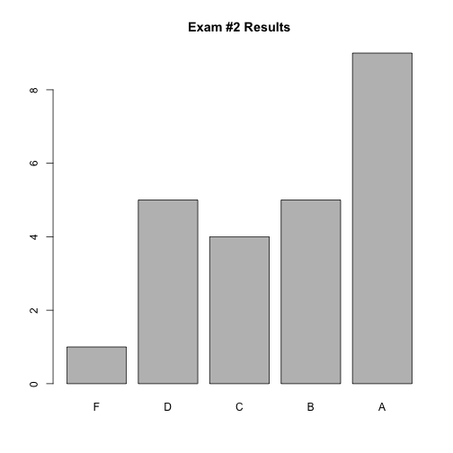
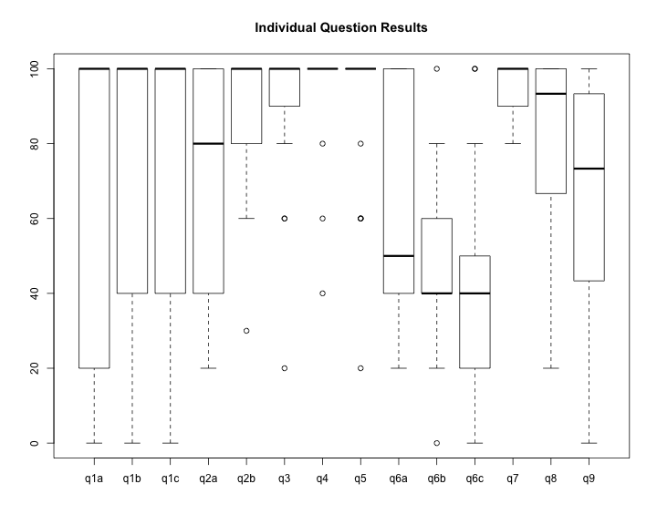

---

title:        COSC 1101 The Beauty & Joy of Computing
subtitle:     Exam #2 Results
author:       Ruben Gamboa
date:         November 20, 2015
#logo:         uw-logo-small.png
#biglogo:      uw-logo-large.png
job:          Professor
highlighter:  highlight.js
hitheme:      tomorrow             # default
mode:         selfcontained        # {standalone, draft}
framework:    io2012               # {io2012, html5slides, shower, dzslides, revealjs, ...}
widgets:      [mathjax, bootstrap] # {mathjax, quiz, bootstrap}

---

<style>
slide.title-slide {
     background-color: #EDE0CF; /* CBE7A5; #EDE0CF; ; #CA9F9D*/
     background-image: url(assets/img/uw-logo-large.png);
     background-repeat: no-repeat;
     background-position: center top;
   }
slide:not(.title-slide) {
    background-image: url(assets/img/uw-logo-small.png);
    background-repeat: no-repeat;
    background-position: right bottom;
    background-size: 24px;
}
</style>

## Exam Questions

Question   | Points | Topic
-----------|--------|-----------------------------------
q1a        |      5 | Metadata
q1b        |      5 | Metadata example
q1c        |      5 | Metadata security challenge
q2a        |      5 | Image file format
q2b        |     10 | Steganography in images
q3         |      5 | Search engine impartiality
q4         |      5 | Search engine raking
q5         |      5 | Search engine business model
q6a        |      5 | Cryptography, public and private keys
q6b        |      5 | Cryptography: encrypting a message
q6c        |      5 | **Bonus** Cryptography: signing a message
q7         |     15 | Balancing encryption
q8         |     15 | Programming count Ds
q9         |     15 | Programming reverse


----

## Grade Distribution


```
##    Min. 1st Qu.  Median    Mean 3rd Qu.    Max. 
##   58.00   69.75   85.50   80.83   92.25  100.00
```

 

---

## Grade Distribution by Question

 
